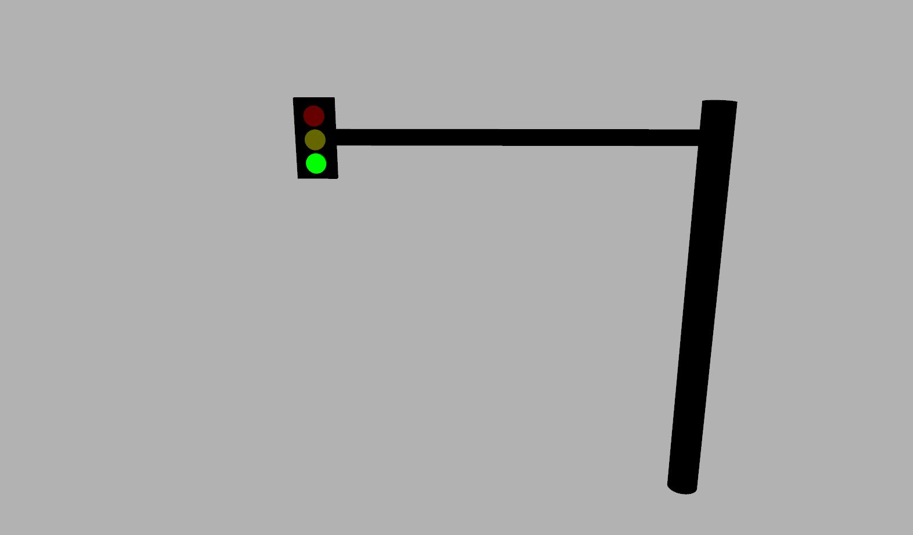

# Gazebo Traffic Light

This repository provides an SDF model of a traffic light, as well as a corresponding Gazebo/ROS plugin that controls the sequencing of the lights. The `plugin_test.world` file shows an example of how the traffic light can be loaded directly or included as part of a larger SDF model. The traffic_light_test.launch file starts up Gazebo and loads a light sequence from a YAML file.

## Limitations

Currently all traffic lights included in the same SDF model will follow the same sequence.